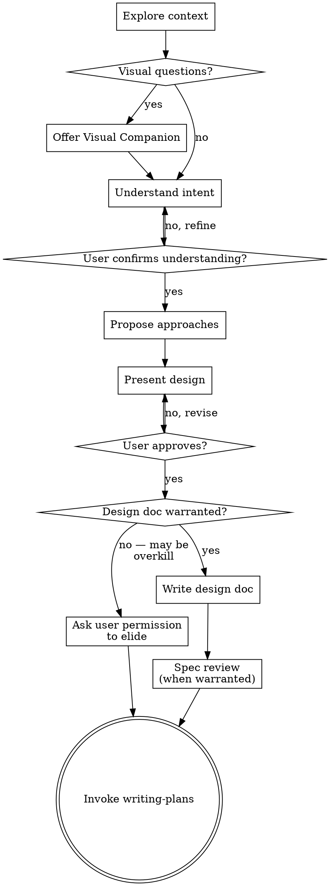

# Brainstorming Ideas Into Designs

## Overview

Help turn ideas into fully formed designs and specs through natural collaborative dialogue. Scale your effort to the task — a link in a header needs a different process than a new subsystem — but always confirm you understand what the user wants before you build anything.

Start by understanding the current project context, then ask questions one at a time to refine the idea. Once you understand what you're building, present the design and get user approval.

<HARD-GATE>
Do NOT invoke any implementation skill, write any code, scaffold any project, or take any implementation action until:
1. You have stated your understanding of the user's intent
2. The user has confirmed that understanding

This applies to every task regardless of size. The confirmation can be brief ("I'll add a GitHub icon-link to the header, styled to match the existing theme — sound right?"), but you must get it.
</HARD-GATE>

## Anti-Pattern: Skipping Understanding

The failure mode is not "too little ceremony." It is jumping to implementation with unchecked assumptions. Simple tasks are where this happens most — you assume you know what the user wants and start editing. Even when you're right about the *what*, you miss preferences about the *how*.

## Checklist

Create tasks to track the steps you'll execute. For a small change, that might be steps 1–3 only. For a large project, all seven.

1. **Explore project context** — check files, docs, recent commits
2. **Offer visual companion** (if topic will involve visual questions) — this is its own message, not combined with a clarifying question. See the Visual Companion section below.
3. **Ask clarifying questions** — one at a time, understand purpose/constraints/success criteria
4. **Propose approaches** — with trade-offs and your recommendation
5. **Present design** — in sections scaled to their complexity, get user approval after each section
6. **Write design doc** — save to `docs/superpowers/specs/YYYY-MM-DD-<topic>-design.md` and commit
7. **Transition to implementation** — invoke writing-plans skill to create implementation plan

Steps 1–4 always happen. Steps 5–7 scale to the task. **GATE — when you believe a step can be safely elided, ask the user for permission.** Do not skip silently. For example: "This is straightforward — I don't think we need a design doc. Want me to go straight to planning?"

## Process Flow

**The terminal state is invoking writing-plans.** Do NOT invoke frontend-design, mcp-builder, or any other implementation skill. The ONLY skill you invoke after brainstorming is writing-plans.

## The Process

**Understanding the idea:**

- Check out the current project state first (files, docs, recent commits)
- Before asking detailed questions, assess scope: if the request describes multiple independent subsystems (e.g., "build a platform with chat, file storage, billing, and analytics"), flag this immediately. Don't spend questions refining details of a project that needs to be decomposed first.
- If the project is too large for a single spec, help the user decompose into sub-projects: what are the independent pieces, how do they relate, what order should they be built? Then brainstorm the first sub-project through the normal design flow. Each sub-project gets its own spec → plan → implementation cycle.
- For appropriately-scoped projects, ask questions one at a time to refine the idea
- Prefer multiple choice questions when possible, but open-ended is fine too
- Only one question per message - if a topic needs more exploration, break it into multiple questions
- Focus on understanding: purpose, constraints, success criteria

**Exploring approaches:**

- Propose 2-3 different approaches with trade-offs
- Present options conversationally with your recommendation and reasoning
- Lead with your recommended option and explain why

**Presenting the design:**

- Once you believe you understand what you're building, present the design
- Scale each section to its complexity: a few sentences if straightforward, up to 200-300 words if nuanced
- Ask after each section whether it looks right so far
- Cover: architecture, components, data flow, error handling, testing
- Be ready to go back and clarify if something doesn't make sense

## After the Design

**Documentation (when warranted):**

- Write the validated design (spec) to `docs/superpowers/specs/YYYY-MM-DD-<topic>-design.md`
  - (User preferences for spec location override this default)
- Use elements-of-style:writing-clearly-and-concisely skill if available
- Commit the design document to git
- **GATE — for small changes, the design doc may be unnecessary.** Ask the user before skipping it.

**Spec Review Loop (when warranted):**
After writing the spec document:

1. Dispatch spec-document-reviewer subagent (see spec-document-reviewer-prompt.md)
2. If Issues Found: fix, re-dispatch, repeat until Approved
3. If loop exceeds 5 iterations, surface to human for guidance

**GATE — for small changes, the spec review may be unnecessary.** Ask the user before skipping it.

**Implementation:**

- Check in with the user before transitioning: "The design is ready. Want me to move on to writing the implementation plan?"
- On confirmation, invoke the writing-plans skill
- Do NOT invoke any other skill. writing-plans is the next step.

**Design for isolation and clarity:**

- Break the system into smaller units that each have one clear purpose, communicate through well-defined interfaces, and can be understood and tested independently
- For each unit, you should be able to answer: what does it do, how do you use it, and what does it depend on?
- Can someone understand what a unit does without reading its internals? Can you change the internals without breaking consumers? If not, the boundaries need work.
- Smaller, well-bounded units are also easier for you to work with - you reason better about code you can hold in context at once, and your edits are more reliable when files are focused. When a file grows large, that's often a signal that it's doing too much.

**Working in existing codebases:**

- Explore the current structure before proposing changes. Follow existing patterns.
- Where existing code has problems that affect the work (e.g., a file that's grown too large, unclear boundaries, tangled responsibilities), include targeted improvements as part of the design - the way a good developer improves code they're working in.
- Don't propose unrelated refactoring. Stay focused on what serves the current goal.

## Key Principles

- **One question at a time** — don't overwhelm with multiple questions
- **Multiple choice preferred** — easier to answer than open-ended when possible
- **YAGNI ruthlessly** — remove unnecessary features from all designs
- **Explore alternatives** — propose approaches before settling
- **Incremental validation** — present, get approval, then move on
- **Be flexible** — go back and clarify when something doesn't make sense

## Visual Companion

A browser-based companion for showing mockups, diagrams, and visual options during brainstorming. Available as a tool — not a mode. Accepting the companion means it's available for questions that benefit from visual treatment; it does NOT mean every question goes through the browser.

**Offering the companion:** When you anticipate that upcoming questions will involve visual content (mockups, layouts, diagrams), offer it once for consent:
> "Some of the upcoming design questions would benefit from visual mockups. I can show those in a browser window so you can see and compare options visually. This feature is still new — it can be token-intensive and a bit slow, but it works well for layout and design questions. Want to try it? (Requires opening a local URL)"

**This offer MUST be its own message.** Do not combine it with clarifying questions, context summaries, or any other content. The message should contain ONLY the offer above and nothing else. Wait for the user's response before continuing. If they decline, proceed with text-only brainstorming.

**Per-question decision:** Even after the user accepts, decide FOR EACH QUESTION whether to use the browser or the terminal. The test: **would the user understand this better by seeing it than reading it?**

- **Use the browser** for content that IS visual — mockups, wireframes, layout comparisons, architecture diagrams, side-by-side visual designs
- **Use the terminal** for content that is text — requirements questions, conceptual choices, tradeoff lists, A/B/C/D text options, scope decisions

A question about a UI topic is not automatically a visual question. "What does personality mean in this context?" is a conceptual question — use the terminal. "Which wizard layout works better?" is a visual question — use the browser.

If they agree to the companion, read the detailed guide before proceeding:
`skills/brainstorming/visual-companion.md`
