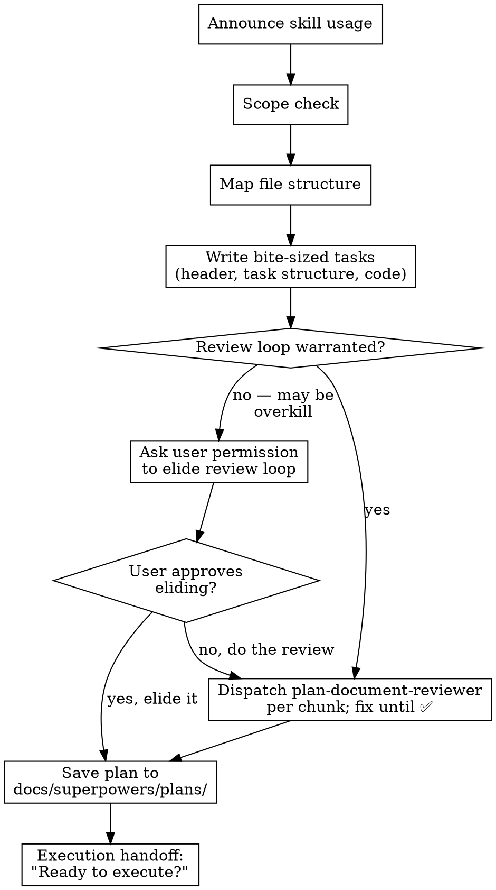

# Writing Plans

## Overview

Scale the plan to the task. A one-file change doesn't need the same plan as a new subsystem. When you believe steps can be safely elided, ask the user for permission — don't elide silently, and don't follow the full process rigidly when it doesn't serve the work.

Write comprehensive implementation plans assuming the engineer has zero context for our codebase and questionable taste. Document everything they need to know: which files to touch for each task, code, testing, docs they might need to check, how to test it. Give them the whole plan as bite-sized tasks. DRY. YAGNI. TDD. Frequent commits.

Assume they are a skilled developer, but know almost nothing about our toolset or problem domain. Assume they don't know good test design very well.

**Announce at start:** "I'm using the writing-plans skill to create the implementation plan."

**Context:** This should be run in a dedicated worktree (created by brainstorming skill).

**Save plans to:** `docs/superpowers/plans/YYYY-MM-DD-<feature-name>.md`
- (User preferences for plan location override this default)

## Scope Check

If the spec covers multiple independent subsystems, it should have been broken into sub-project specs during brainstorming. If it wasn't, suggest breaking this into separate plans — one per subsystem. Each plan should produce working, testable software on its own.

## File Structure

Before defining tasks, map out which files will be created or modified and what each one is responsible for. This is where decomposition decisions get locked in.

- Design units with clear boundaries and well-defined interfaces. Each file should have one clear responsibility.
- You reason best about code you can hold in context at once, and your edits are more reliable when files are focused. Prefer smaller, focused files over large ones that do too much.
- Files that change together should live together. Split by responsibility, not by technical layer.
- In existing codebases, follow established patterns. If the codebase uses large files, don't unilaterally restructure - but if a file you're modifying has grown unwieldy, including a split in the plan is reasonable.

This structure informs the task decomposition. Each task should produce self-contained changes that make sense independently.

## Bite-Sized Task Granularity

**Each step is one action (2-5 minutes):**
- "Write the failing test" - step
- "Run it to make sure it fails" - step
- "Implement the minimal code to make the test pass" - step
- "Run the tests and make sure they pass" - step
- "Commit" - step

## Plan Document Header

**Every plan MUST start with this header:**

```markdown
# [Feature Name] Implementation Plan

> **For Claude:** REQUIRED: Use superpowers:subagent-driven-development (if subagents available) or superpowers:executing-plans to implement this plan. Steps use checkbox (`- [ ]`) syntax for tracking.

**Goal:** [One sentence describing what this builds]

**Architecture:** [2-3 sentences about approach]

**Tech Stack:** [Key technologies/libraries]

---
```

## Task Structure

````markdown
### Task N: [Component Name]

**Files:**
- Create: `exact/path/to/file.py`
- Modify: `exact/path/to/existing.py:123-145`
- Test: `tests/exact/path/to/test.py`

- [ ] **Step 1: Write the failing test**

```python
def test_specific_behavior():
    result = function(input)
    assert result == expected
```

- [ ] **Step 2: Run test to verify it fails**

Run: `pytest tests/path/test.py::test_name -v`
Expected: FAIL with "function not defined"

- [ ] **Step 3: Write minimal implementation**

```python
def function(input):
    return expected
```

- [ ] **Step 4: Run test to verify it passes**

Run: `pytest tests/path/test.py::test_name -v`
Expected: PASS

- [ ] **Step 5: Commit**

```bash
git add tests/path/test.py src/path/file.py
git commit -m "feat: add specific feature"
```
````

## Remember
- Exact file paths always
- Complete code in plan (not "add validation")
- Exact commands with expected output
- Reference relevant skills with @ syntax
- DRY, YAGNI, TDD, frequent commits

## Process Flow



## Plan Review Loop

**GATE — Do not elide without permission.** For small, single-file changes, the review loop may be unnecessary. If you believe it can be safely elided, you MUST ask the user before proceeding without it. Do not silently skip the review loop. Do not treat this as optional. Present your reasoning and wait for the user's answer.

After completing each chunk of the plan:

1. Dispatch plan-document-reviewer subagent (see plan-document-reviewer-prompt.md) for the current chunk
   - Provide: chunk content, path to spec document
2. If ❌ Issues Found:
   - Fix the issues in the chunk
   - Re-dispatch reviewer for that chunk
   - Repeat until ✅ Approved
3. If ✅ Approved: proceed to next chunk (or execution handoff if last chunk)

**Chunk boundaries:** Use `## Chunk N: <name>` headings to delimit chunks. Each chunk should be ≤1000 lines and logically self-contained.

**Review loop guidance:**
- Same agent that wrote the plan fixes it (preserves context)
- If loop exceeds 5 iterations, surface to human for guidance
- Reviewers are advisory - explain disagreements if you believe feedback is incorrect

## Execution Handoff

After saving the plan:

**1. Record context.** Before anything else, verify all artifacts are saved and the plan is self-contained:
- Spec document path (if one was written)
- Plan document path
- Key architectural decisions, constraints, or user preferences that affect implementation but aren't captured in the plan — add them to the plan now

**2. Advise compaction.** Execution works better with a fresh window. Tell the user:

> "The plan is saved to `docs/superpowers/plans/<filename>.md`. Before we start implementation, I recommend compacting this session — execution works better with a fresh window."

**3. Give exact continuation prompt.** Tell the user exactly what to say after compacting. Use the actual filename, not a placeholder.

If you can dispatch subagents (Claude Code, etc.):

> "After compacting, say: **Execute the plan at `docs/superpowers/plans/<filename>.md` using subagent-driven-development.**"

If you cannot dispatch subagents, ask the user: "The plan is ready. I can't dispatch subagents in this environment — should I execute the tasks in this thread?"
